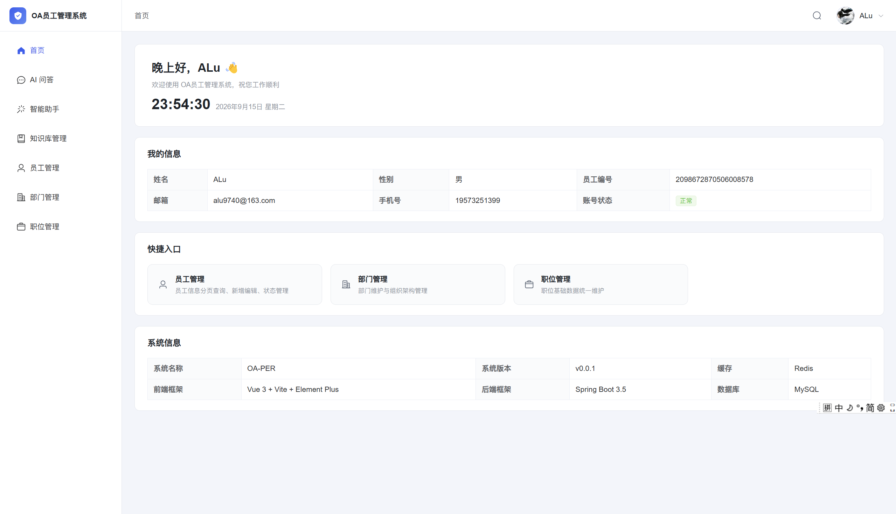
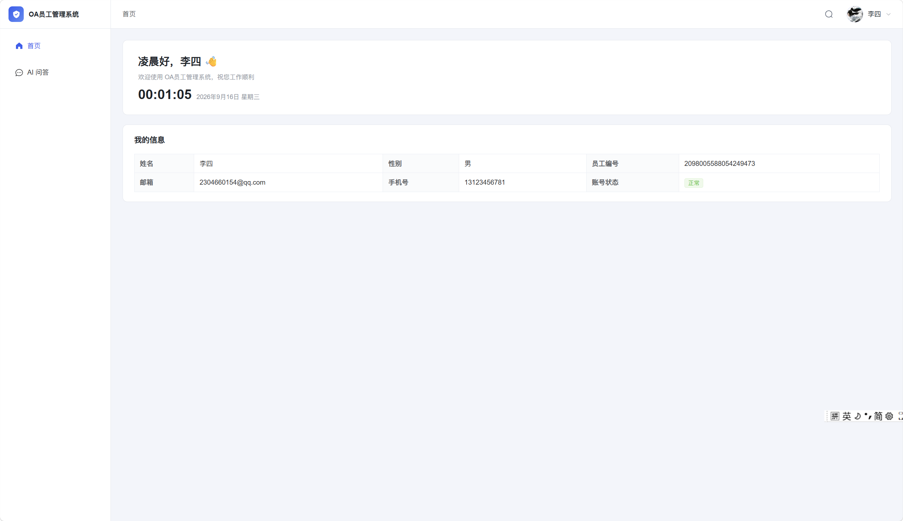

# OA-PER 轻量级智能 OA 人事管理系统


OA-PER 是一套前后端分离的轻量级 OA 人事管理系统，覆盖账号认证、员工 / 部门 / 职位管理等基础人事场景，并内置了两个基于大模型的 AI 能力：面向管理员的 ReAct 智能助手（可通过自然语言直接操作人事数据），以及面向全员的知识库 RAG 问答。

## **系统截图**

### 管理员首页



### 员工首页



## 功能总览

### 账号与认证

- 邮箱验证码注册、完善个人资料、找回密码（163 邮箱 SMTP）
- JWT 双 Token 认证：AccessToken 2 小时 / RefreshToken 7 天，支持无感续期
- Spring Security 统一鉴权，管理端接口强制 `ROLE_ADMIN`，前端路由守卫同步拦截

### 基础人事管理

- **员工管理**（管理员）：分页查询、部门 / 职位 / 入职日期 / 账号状态多条件筛选、新增（工号自动生成）、编辑、账号禁用启用、批量删除
- **部门管理 / 职位管理**（管理员）：增删改查；存在在职员工的部门或职位不可删除，由后端校验拦截
- **个人中心**（全员）：个人资料查看与修改、头像上传（MinIO 私有桶存储，经后端代理访问，不暴露直链）

### AI 智能能力

- **管理员智能助手**：基于 Spring AI 与 ReAct 模式的 Function Calling 智能体，用自然语言完成员工查询、部门 / 职位查询、员工调动、账号禁用启用等操作，工具调用过程实时展示
- **员工 AI 问答**：基于 Qdrant 向量库的 RAG 检索增强问答，答案来自企业知识库文档
- **知识库管理**（管理员）：支持 pdf / doc / docx / txt / md 文档上传（单文件 ≤ 20MB），Apache Tika 解析后分块向量化入库，提供处理状态跟踪与删除
- **流式输出与会话管理**：SSE 流式响应（delta / tool / done / error 事件协议），支持多会话创建、切换、删除与历史消息持久化

### 工程实践

- 前后端分离，开发环境全站 HTTPS（mkcert 本地证书），Vite 代理转发 `/api` 与 `/minio` 规避跨域
- 雪花 ID 在 JSON 中全局序列化为字符串，规避 JavaScript 精度丢失
- 配置全部由环境变量驱动（`.env`），密钥等敏感信息不进入仓库
- 全局统一响应结构 `Result<T>` 与业务异常处理

## 技术栈

| 分类 | 技术 |
| --- | --- |
| 前端 | Vue 3.5、Vue Router 4、Element Plus 2.9、Axios、Vite 8、marked + DOMPurify |
| 后端 | Java 17、Spring Boot 3.5、Spring Security + JJWT、MyBatis-Plus 3.5、Spring Validation、Spring Mail、Hutool |
| 数据存储 | MySQL 8.0、Redis、MinIO、Qdrant |
| AI | Spring AI 1.1.8（OpenAI 兼容模式）、阿里云 DashScope（qwen3.7-flash / text-embedding-v4）、Apache Tika 2.9 |

## 项目结构

```
oa_per
├── backend                              # 后端服务（Spring Boot）
│   ├── src/main/java/com/oa_server
│   │   ├── common                       # 统一响应 Result、全局异常、实体基类
│   │   ├── config                       # Security / AI / MinIO / Redis / Jackson / MyBatis-Plus 配置
│   │   ├── security                     # JWT 过滤器、工具类、UserDetails 实现
│   │   └── module
│   │       ├── auth                     # 注册 / 登录 / 验证码 / 找回密码 / Token 续期
│   │       ├── emp                      # 员工资料、RAG 问答
│   │       ├── file                     # MinIO 文件代理
│   │       ├── ai/chat                  # AI 会话与消息持久化
│   │       └── admin                    # 管理端
│   │           ├── emps                 # 员工管理
│   │           ├── depts                # 部门管理
│   │           ├── jobs                 # 职位管理
│   │           ├── kb                   # 知识库管理
│   │           └── agent                # ReAct 智能助手（@Tool 工具集）
│   └── src/main/resources
│       ├── db/schema.sql                # 数据库初始化脚本
│       ├── mapper                       # MyBatis XML
│       └── application*.yml             # 多环境配置（dev / prod）
└── frontend                             # 前端应用（Vue 3 + Vite）
    └── src
        ├── api                          # 接口封装（axios 拦截器、SSE 流式读取）
        ├── layouts                      # 后台整体布局（侧边栏 / 顶栏 / 菜单搜索）
        ├── router                       # 路由与管理员权限守卫
        ├── utils                        # 登录态缓存、请求封装
        ├── components                   # 公共组件
        └── views                        # 登录 / 首页 / 个人中心 / 员工 / 部门 / 职位 / AI 问答 / 智能助手 / 知识库
```

## 环境要求

- JDK 17+
- Node.js ≥ 20.19（推荐 22 LTS）
- MySQL 8.0+
- Redis
- MinIO
- Qdrant 1.10+
- 阿里云 DashScope API Key（AI 功能必需）
- [mkcert](https://github.com/FiloSottile/mkcert)（生成开发环境 HTTPS 证书）

如本机未部署中间件，可使用 Docker 快速启动：

```bash
docker run -d --name redis -p 6379:6379 redis:7
docker run -d --name minio -p 9000:9000 -p 9001:9001 \
  minio/minio server /data --console-address ":9001"
docker run -d --name qdrant -p 6333:6333 -p 6334:6334 qdrant/qdrant
```

## 快速开始

### 1. 获取代码

```bash
git clone <your-repo-url>
cd oa_per
```

### 2. 初始化数据库

创建数据库并执行初始化脚本：

```sql
CREATE DATABASE oa_per DEFAULT CHARACTER SET utf8mb4;
```

```bash
mysql -u root -p oa_per < backend/src/main/resources/db/schema.sql
```

同时在 MinIO 控制台（http://localhost:9001）创建名为 `oa-per` 的私有存储桶。

### 3. 配置并启动后端

```bash
cd backend
copy .env.example .env    # macOS / Linux 使用 cp
```

编辑 `.env`，填入 MySQL、Redis、MinIO、163 邮箱授权码、JWT 密钥与 DashScope API Key。环境变量加载方式见 `.env.example` 文件头部注释（IDEA EnvFile 插件 / 命令行 source / IDE 环境变量三选一）。

生成本地 HTTPS 证书并放入 `backend/src/main/resources/ssl/`：

```bash
mkcert -install
mkcert localhost 127.0.0.1 ::1
# 将 localhost+2.pem 与 localhost+2-key.pem 复制到 src/main/resources/ssl/
```

启动后端（端口 8097）：

```bash
mvn spring-boot:run
```

### 4. 配置并启动前端

```bash
cd frontend
npm install
```

同样使用 mkcert 生成证书并放入 `frontend/ssl/`（文件命名同上），默认已通过 `.env.development` 完成配置，将 `/api` 与 `/minio` 代理到后端。

启动开发服务器（HTTPS，端口 5173）：

```bash
npm run dev
```

### 5. 访问系统

浏览器打开 https://localhost:5173 ，注册账号并完成资料填写后登录。

## 使用说明

- 新注册用户默认为普通员工角色；首个管理员需手动将数据库 `emp` 表中对应用户的 `role_type` 字段改为 `1`
- 管理员通过员工管理创建的账号初始密码为 `123456`
- 管理员专属功能：员工管理、部门管理、职位管理、知识库管理、智能助手
- 全员功能：AI 问答、个人中心
- AI 问答依赖知识库文档，请先以管理员身份在知识库管理中上传文档，待状态变为已入库后即可提问

## 生产部署

- **后端**：`mvn clean package -DskipTests` 打包，以 `prod` profile 运行 jar，并通过环境变量注入配置
- **前端**：`npm run build` 生成 `dist/`，由 Nginx 托管静态资源，并将 `/api`、`/minio` 反向代理至后端服务（`.env.production` 中 API 地址已按此约定配置为 `/api`）

## Roadmap

- [x] v0.0.1 基础人事管理 + 管理员智能助手 + 知识库 RAG 问答
- [ ] 考勤打卡与请假审批
- [ ] 公告通知
- [ ] 操作日志与审计
- [ ] 单元测试与 CI

以上为初步规划方向，欢迎通过 Issue 提出建议。

## License

本项目暂未声明开源协议，如需引用或二次开发请先与作者联系。
